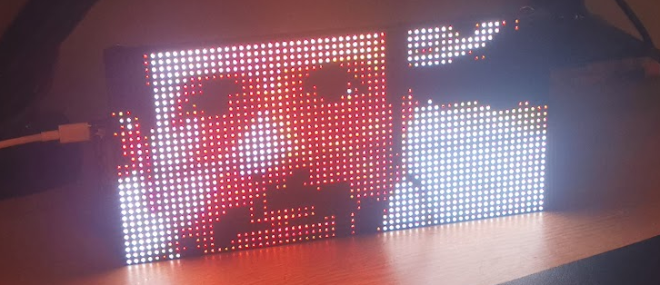

# Matrix Portal M4 MQTT Display

An experimental LED matrix display using the [AdaFruit Matrix Portal M4](https://www.adafruit.com/product/4745)
controller and a [64x32 MOD75 LED Matrix Panel](https://www.adafruit.com/product/2279), controlled via [MQTT](https://en.wikipedia.org/wiki/MQTT) for use with IoT and Home Automation projects such as [Home Assistant](https://www.home-assistant.io/).

## Development

Install a Python `virtualenv` and install the [CircUp](https://github.com/adafruit/circup) library manager:

    python -m venv ./venv
    source ./venv/bin/activate
    pip install circup

Connect Matrix Portal M4 to device and confirm USB device is connected and
automatically mounted (e.g. `/media/${USER}/CIRCUITPY`):

    ls /dev/ttyACM0
    ls /media/${USER}/CIRCUITPY

Deploy the project source and other resources to the Matrix Portal:

    scripts/deploy.sh
